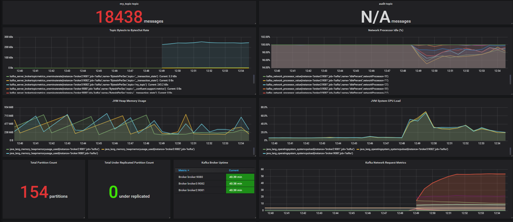

# Docker-Services

in this repository you can find a `docker-compose.yml` file with the services needed to run a kafka cluster with monitoring enabled as a base for Data Engineering projects.

## Instalation

First, [install](https://docs.docker.com/install/) docker and docker-compose ,  docker needs enough resources to handle the load of all the services we are going to run , at least **3** cores and **4GB** of ram are needed to properly run the container.

Once docker is installed clone this project `git clone https://github.com/JesusZapata87/Docker-Services` ,  once cloned , navigate to the project directory using a power-shell or command shell and run `docker-comopose up`  , if you want to run the containers as a daemon process you can  run `docker-compose up -d` to start it , and `docker-compose down` to stop the container.

```
docker-compose up -d
 
Starting zookeeper2 ... done
Starting grafana    ... done
Starting mongodb    ... done
Starting influxdb   ... done
Starting zookeeper  ... done
Starting broker     ... done
Starting zookeeper3 ... done
Starting broker2    ... done
Starting broker3    ... done
Starting prometheus ... done
```

```
docker-compose down
Stopping prometheus ... done
Stopping broker3    ... done
Stopping broker2    ... done
Stopping zookeeper3 ... done
Stopping broker     ... done
Stopping zookeeper  ... done
Stopping grafana    ... done
Stopping influxdb   ... done
Stopping zookeeper2 ... done
Stopping mongodb    ... done
Removing prometheus ... done
Removing broker3    ... done
Removing broker2    ... done
Removing zookeeper3 ... done
Removing broker     ... done
Removing zookeeper  ... done
Removing grafana    ... done
Removing influxdb   ... done
Removing zookeeper2 ... done
Removing mongodb    ... done
Removing network newcompose_default
```

It is recommended to add entries to the host file to identify and access all the services by name on the host machine. eg.

```
 /etc/hosts or C:\Windows\System32\Drivers\etc\hosts

127.0.0.1       broker
127.0.0.1       broker2
127.0.0.1       broker3
127.0.0.1       grafana
127.0.0.1       mongodb
127.0.0.1       influxdb
```
## Services

The following services will be started

- Zookeeper Cluster (3 nodes)
	Listening on ports `12181` , `12182`, `12183`
	
- Apache Kafka Cluster (3 nodes)
	Listening in ports `19092`, `19093` , `19092`
	
- Prometheus
- Grafana
	Listening on port `3000`
	
- Mongodb
	Listening on port `27017`	
	
- Influxdb
	Listening on port `8083`

#### Grafana
Grafana uses data provisioning to create a  **Prometheus**  data-source and a dashboard pre-configured with metrics related to the **Apache Kafka** cluster 
and a topic called  `my_topic` this can be used as reference for new dashboards and panel but it is  perfectly functional as it is.

 

## Troubleshooting [WIP]

Docker images state may be corrupted or have issues while development is on course , if you have any issues starting the services you can do as follow:

 - Stop all containers , run `docker-compose down`
- Run  `docker system prune` , this will remove all stopped containers, all dangling images, and all unused networks
- Start the containers using `docker-compose up`

If running `docker-compose down` hangs, either force it using `Ctrl+C` or manually restart the docker service , then run `docker system prune`

If the issue persist, try removing the images altogether using `docker-compose rm -vfs`